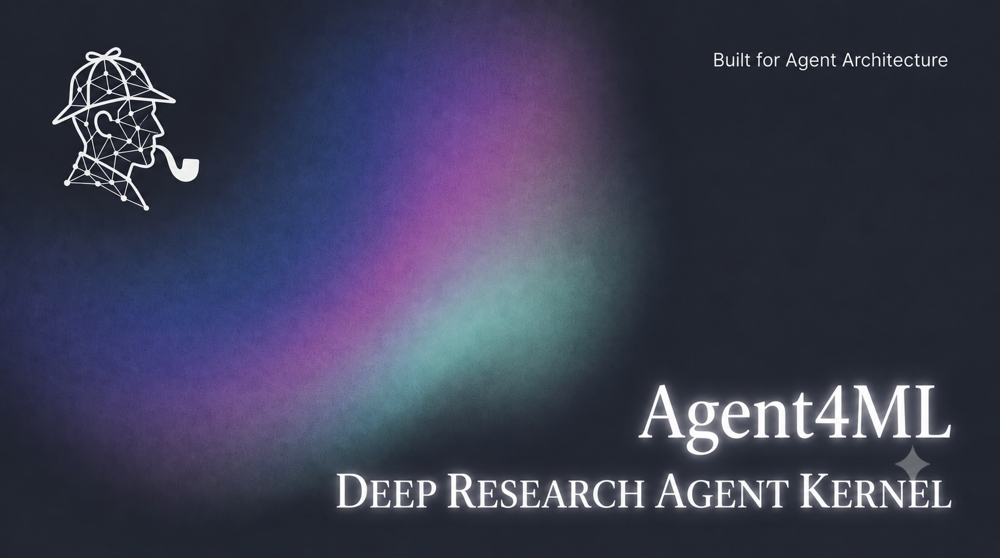
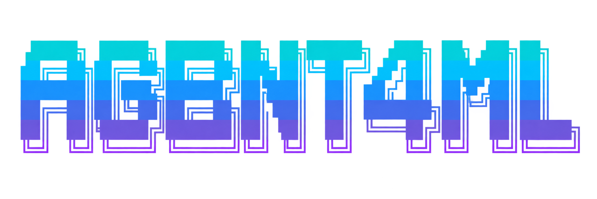
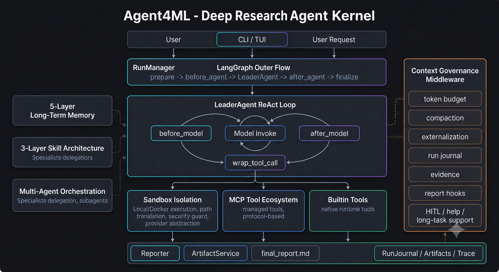
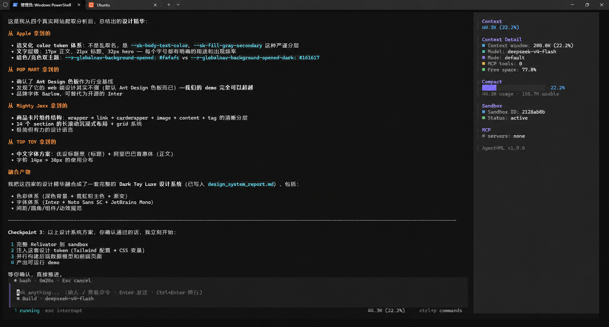

<div align="center">



### A Deep Research Agent Kernel with Long-Term Memory

[](LICENSE)
[](https://www.python.org/)
[](https://github.com/langchain-ai/langgraph)
[](https://www.deepseek.com/)

**📚 Documentation:** [English](USAGE.md) · [简体中文](resource/USAGE.zh-CN.md) · [ML 科研助理方案](resource/ML_RESEARCH_ASSISTANT.zh-CN.md) · [日本語](resource/USAGE.ja.md)

<sub>ReAct Loop · Context Governance · 5-Layer Memory · Multi-Agent Orchestration · Skill Self-Evolution · Sandbox Isolation</sub>

</div>

---

<picture>
  <source media="(prefers-color-scheme: dark)" srcset="resource/assets/agent4ml-logo.png">
  
</picture>

## Overview

Agent4ML is a deep research agent kernel built for those who care about **how** agents are architected. Rather than chasing a feature checklist, Agent4ML establishes a clean, decoupled, evaluable foundation — from the ReAct core loop to context engineering governance, from a five-layer long-term memory system to multi-agent orchestration with shared sandbox isolation, from sandbox path enforcement to a three-layer skill self-evolution system.

Every module is independently designed, independently tested, and independently verifiable. **2400+ tests** guard every layer.

---

## Core Modules

### 🧠 ReAct Research Kernel

A single `LeaderAgent` orchestrates the research loop. LangGraph handles outer flow orchestration (`prepare → leader_agent → finalize`), while **21 middleware** cross-cut every lifecycle hook: `before/after_agent`, `before/after_model`, `wrap_tool_call`.

**Breakthrough:** Middleware are first-class citizens — memory recall, skill injection, sandbox lifecycle, consolidation, tool-call pairing, help requests, and context governance are all pluggable cross-cutting concerns, not embedded in the agent loop. The `app → agents` dependency is strictly one-directional.

### 📐 Context Engineering Governance

The `DefaultStrategy` dynamically externalizes historical messages based on a live token budget. Window size is resolved by **penetrating through the `FallbackChatModel`** to the active provider's real context window — no hardcoded thresholds. Dual strategies — compaction (summarization) and externalization (offloading) — prevent context overflow in long research sessions without losing critical information.

**Breakthrough:** The governance layer treats token budget as a first-class runtime concern. The fraction denominator is the *real* model window (resolved at call time), not a static config — making P5 circuit-breaker thresholds accurate across provider switches.

### 🧬 Five-Layer Long-Term Memory

Agent4ML implements a cognitive-science-inspired memory system across five layers, each independently testable:

| Layer | Role | Key Breakthrough |
|-------|------|-----------------|
| **L1** | Schema + Protocol | `MemoryTrace` frozen dataclass (15 fields) + `MemoryType` enum (episodic/semantic/procedural) + 5 atomic operations (Encode/Retrieve/Associate/Consolidate/Reconsolidate) — **tools have no LLM**, pure data operations |
| **L2** | Default Strategies | Ebbinghaus decay formula (`strength = base×(1-decay)^hours + log(1+access)×0.1 + importance×0.05`) + composite forget (TTL + strength threshold) + 6 hard-wired decisions (A1-F2) — **lazy decay**, strength computed at retrieve time, no background tasks |
| **L3** | Store + Retriever | `MarkdownFileStore` (single `traces.md` truth source + `<!-- trace: {id} -->` separators + YAML frontmatter) + `HybridRetriever` (pure BM25, no vector/graph dependency) — **retrieve reinforcement write-back** (1A:命中后 store.update 强化 strength) + **forgotten filtering** (3B: metadata.forgotten=True excluded) + **incremental index** (5B: store decorator triggers retriever.on_trace_*) |
| **L4** | Middleware + Bootstrap | `MemoryMiddleware.abefore_model` — per-call `HumanMessage` injection (protects prompt caching, `hide_from_ui=True`) + `set_turn_id` ContextVar (traceability C: actor = turn:N) + bootstrap lifecycle (lazy-load double-check lock + `set_memory_config` global singleton sync) |
| **L5** | Auto-Consolidation | `MemoryConsolidationMiddleware.aafter_model` — **non-blocking** submit every N turns + `MemoryWorker` (daemon thread + `threading.Queue` + LLM construction injection) — LLM extracts episodic memories → `manager.encode` → candidate ≥ N → LLM generates merged content → `manager.consolidate` (max=10, E1) — **errors: log + skip**, never blocks main loop |

**Key Design:** Memory injection is per-call `HumanMessage` (not system prompt), protecting the LLM's prompt cache prefix. `recalled_memories` in state stores only indices (id+score+strength), not full content. The `MemoryConfig` has 4 STARTUP_ONLY fields (use/storage_path/vector_store/graph_store) — the rest are runtime-swappable via `set_memory_config()`.

### 🤝 Multi-Agent Orchestration

Agent4ML supports delegating sub-tasks to external coding agents and internal self-copies:

- **Specialist Delegation** — `delegate_to_specialist(goal, success_criteria)` routes to external CLIs (pi / codex / claude) via MCP `SpecialistMcpServer` (8 sandbox tools exposed). Each specialist runs as a separate process with its own LLM, but shares the **same Docker sandbox** via `--sandbox-url` passthrough.
- **Subagent (Self-Copy)** — `delegate_to_subagent(goal)` creates an Agent4ML self-copy with isolated context (no inherited message history) but shared thread sandbox. `SandboxMiddleware.abefore_model` restores `ContextVar` from `state["sandbox"]` — subagent reuses parent's `sandbox_id` without re-acquiring.
- **L2 Evolution Layer** — data-driven specialist self-evolution: `MetricMonitor` triggers when `effective_rate < threshold`, `IVEFocuser` diagnoses, `LLMMutator` varies, `ScoreDeltaGate` gates, `GitRatchet` rollbacks on degradation.
- **L3 Eval Layer** — three-layer evaluation: execution judgment (per-skill per-task LLM), task quality scoring (4-dimension weighted), response contract checking. `RuntimeTracker` feeds degradation signals back to L2.

**Breakthrough:** The "shared thread sandbox" (INV#3) is now **actually implemented** — subagent restores ContextVar from state, specialist connects to write to the same mount area, not ephemeral container-internal paths.

### 🛡️ Sandbox Isolation with Path Enforcement

Two providers: **Local** (host process, for development) and **Docker** (container isolation, for production).

**Docker mode breakthroughs:**
- **`DockerPathTranslator`** — `translate_path` passes through (container path = bind mount path), `reverse_translate` maps `/mnt/agent4ml/user-data/<x>` → `<sandbox_root>/<sandbox_id>/<x>` (Windows host path) — fixes the `present_files` artifact extraction chain (`shutil.copy2` now gets a real Windows path, not a container path)
- **`DockerPathGuard`** — write path whitelist: `write_file`/`str_replace` paths must be under `/mnt/agent4ml/user-data/`, bash redirect targets (`>{1,2}\s*(/[^\s;|&]*)`) must be in mount area — **forces agent writes to persist**, not lost in container-internal `/tmp` on `--rm`
- **Warm pool** — pre-created containers reduce cold-start latency
- **Idle auto-destroy** — `AGENT4ML_SANDBOX_IDLE_TIMEOUT=600` (10min)
- **Cross-process lock** — concurrent Agent4ML instances don't conflict (3-function lock: open/lock/unlock)
- **WSL2 executor** — `WslDockerExecutor` translates `D:\foo\bar` → `/mnt/d/foo/bar` for Docker daemon in WSL2

### 🔌 MCP Tool Ecosystem

Three transports: `stdio`, `sse`, `http`. Core tools load at startup; non-core tools defer-load on demand. Tool equivalence fallback chains (e.g., `web_search` → MCP server → builtin ddg) ensure resilience. Tool metadata drives externalization thresholds. Configured via `.agent4ml/mcp_servers.yaml`.

### 🎯 Three-Layer Skill Architecture

Skills are **research process knowledge bundles** — prompt-level injections, not executable functions. "How to verify a source" is a skill. "Execute a web search" is a tool.

- **Layer 1 (Base):** SQLite storage with version DAG, quality-filtered LLM hybrid selection, injection middleware, and four-counter metrics (selections / applied / completions / fallbacks).
- **Layer 2 (Evolution):** `IVEFocuser` diagnosis, `LLMMutator` variation, `ScoreDeltaGate` gating, `GitRatchet` ratchet rollback. Skills auto-evolve when effective rate drops below threshold.
- **Layer 3 (Eval):** Three-layer evaluation — execution judgment, task quality scoring (4-dimension weighted), response contract checking. `RuntimeTracker` monitors applied-rate trends and feeds degradation signals back to Layer 2.

40 builtin skills across 5 categories (core / research / software-development / creative / productivity). Core skills auto-load; others discoverable via `/skill search`.

### 🎨 Dual UI

- **TUI** (default): Full-screen Textual app with welcome view + conversation view. Left scrollable log, bottom input box, status bar with live token usage. Wide screens show right-side session info panel.
- **CLI** (`agent4ml cli`): Traditional scrolling mode with `prompt_toolkit` + `rich`. Slash-command completion + bottom toolbar.

### 🔄 Multi-LLM Fallback

`FallbackChatModel` constructs a role-based routing chain (researcher / reporter). On transient API failures (rate limit, timeout, 5xx), it automatically degrades to the next provider. DeepSeek always sits at the chain tail as the ultimate fallback.

### 📊 Observability

`RunJournal` records structured events (`skill.select`, `skill.apply`, `memory.encode`, `memory.consolidate`, `compaction`, `budget`). Thread directories persist run artifacts. The `/expand` command unfolds the previous round's full Thought text and tool results.

---

## Architecture

<div align="center">



</div>

<sub>Outer flow: `prepare → before_agent → LeaderAgent (ReAct loop) → after_agent → finalize`. 21 middleware cross-cut every hook. Memory recall (L4) happens in `before_model`, consolidation (L5) in `after_model`. Skill injection (L1+L2+L3) in `before_model`. Tool calls route through Sandbox / MCP / Builtin via `wrap_tool_call`. Multi-agent delegation via `delegate_to_specialist` / `delegate_to_subagent`.</sub>

---

## Quick Start

```bash
# 1. Clone
git clone https://github.com/whalezhang0320/agent4ml.git && cd agent4ml

# 2. Create environment (Python 3.12+)
python -m venv .venv
.venv\Scripts\activate         # Windows
# source .venv/bin/activate    # Linux / macOS

# 3. Install
pip install -e ".[dev]"

# 4. Configure
cp .env.example .env
# Edit .env — fill in at least: DEEPSEEK_API_KEY=sk-xxx

# 5. Launch (TUI by default)
agent4ml
```

<sub>Type a question to start researching. Type `/` for command completion, `/help` for all commands.</sub>

### Enable Advanced Features

```env
# Long-term memory (L4 recall + L5 auto-consolidation)
AGENT4ML_MEMORY_USE=default
AGENT4ML_MEMORY_PHASE2_ENABLED=true
AGENT4ML_MEMORY_PHASE2_TURNS=10

# Skill system (L1 base + L2 evolution + L3 eval)
AGENT4ML_SKILL_ENABLED=true
AGENT4ML_SKILL_EVOLVE_ENABLED=true
AGENT4ML_SKILL_EVAL_ENABLED=true
AGENT4ML_SKILL_MAX_INJECT=15

# Multi-Agent (specialist delegation + L2/L3)
AGENT4ML_MULTIAGENT_ENABLED=true
AGENT4ML_MULTIAGENT_L2_ENABLED=true
AGENT4ML_MULTIAGENT_L3_ENABLED=true

# Docker sandbox (container isolation)
AGENT4ML_SANDBOX_USE=agent4ml.backend.agents.sandbox.docker.docker_sandbox_provider:DockerSandboxProvider
AGENT4ML_SANDBOX_EXECUTOR=wsl              # Windows + WSL2 Docker

# MCP tools
AGENT4ML_MCP_ENABLED=true
```

> **👉 For full configuration, commands, and troubleshooting — see the [Usage Guide](USAGE.md).**

---

## Screenshots

<div align="center">



<sub>TUI Conversation View — dual-panel layout with live context governance, sandbox status, and memory recall</sub>

</div>

---

## Tech Stack

<div align="center">


</div>

---

## Acknowledgments

Agent4ML stands on the shoulders of giants. The architecture draws inspiration from several outstanding open-source projects and research frameworks:

**Agent Architecture** — The middleware-first design and ReAct loop orchestration patterns are inspired by modern-based agent frameworks. The separation of concerns — where memory, skills, sandbox, and tool routing are pluggable cross-cutting middleware rather than embedded agent logic — builds upon ideas from conversational agent platforms that prioritize decoupled, testable architectures.

**Memory System** — The five-layer memory architecture (schema → strategies → store → middleware → auto-consolidation) is informed by cognitive science models of episodic, semantic, and procedural memory. The Ebbinghaus decay formula, lazy strength computation, and Markdown-as-truth-source patterns draw from long-term memory research in AI agent design. The "tools have no LLM" principle — where atomic operations are pure data transformations and LLM orchestration lives in the middleware layer — is inspired by memory framework designs that separate engine from orchestration.

**Multi-Agent Orchestration** — The specialist delegation model (where Agent4ML delegates coding tasks to external CLI agents via MCP) and the shared-thread-sandbox concept build upon multi-agent collaboration patterns from coding agent ecosystems. The idea that a lead agent can orchestrate specialized sub-agents — each with their own LLM and toolset — while sharing a unified sandbox for artifact continuity, is informed by production multi-agent system designs.

**Sandbox Isolation** — The three-component sandbox model (Runtime + PathTranslator + SecurityGuard) and the warm-pool lifecycle management are inspired by sandbox isolation patterns from deep research agent platforms. The Docker path translation and mount-area enforcement address real-world challenges of cross-platform (Windows + WSL2 + Docker) file persistence.

**Skill Self-Evolution** — The three-layer skill architecture (base storage → LLM-driven evolution → multi-dimensional evaluation) with ratchet rollback and quality gating builds upon self-improving agent research. The concept of skills as "process knowledge bundles" (prompt-level injections, not executable functions) draws from prompt engineering and skill management frameworks.

We gratefully acknowledge the developers and researchers of these projects whose work — whether through direct code patterns, architectural ideas, or research papers — made Agent4ML possible.

---

## License

[MIT](LICENSE) © Agent4ML Authors

---

<div align="center">

<sub>Built for those who care about how agents are built.</sub><br>
<sub>If this project helps you, a ⭐ is appreciated.</sub>

</div>
